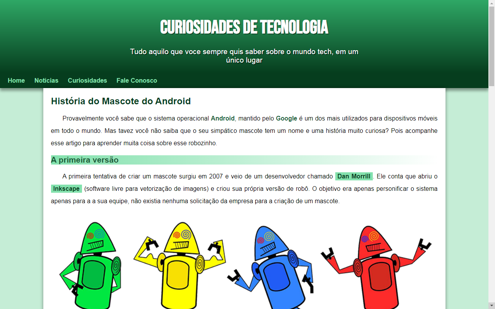

<h1 align='center'>Projeto android</h1>

 

<a href='https://evanilsonpg.github.io/projeto-android/'>Clique aqui e veja o Projeto --></a>

 

<h2 align='center'>Descrição</h2> 

**Projeto** criado baseado no que aprendi ultilizando as tecnologias **HTML, CSS** no início da minha jornada como Dev .

 

<h2 align='center'>Sobre</h2>

Projeto android bem simples com responsividade para aprimorar meus conhecimentos .
 
 

### **Tecnologias usadas** ->
 

- [HTML]()
- [CSS]()

